# 🤖 Projeto Multiagentes com CoppeliaSim e MQTT

**Alunos:** Kelton Martins Dias, Mariane e Elivan

**Orientador:** Prof. Felipe Mota

**Instituição:** Instituto Federal do Norte de Minas Gerais – Campus Januária

## 🧠 Visão Geral

Este projeto simula um sistema multiagente robótico utilizando o simulador **CoppeliaSim** e comunicação por meio do protocolo **MQTT**.
A proposta envolve múltiplos robôs autônomos que colaboram para manipular blocos em um ambiente simulado.

## ⚙️ Tecnologias Utilizadas

* **CoppeliaSim** (simulador de robótica)
* **MQTT para comunicação entre agentes**
* **paho-mqtt** (cliente MQTT em Python)
* **Mosquitto** (servidor MQTT broker)
* **Python 3.10+**

## 🤖 Agentes Envolvidos

| Agente     | Função                                                       |
| ---------- | ------------------------------------------------------------ |
| **Franka** | Coleta o bloco da esteira e entrega ao youBot.               |
| **youBot** | Recebe o bloco do Franka e leva até o robô UR10.             |
| **UR10**   | Pega o bloco do youBot e armazena cuidadosamente na estante. |
| **Sensor** | Detecta a presença de blocos na esteira e aciona o processo. |

## 🎯 Missão

Automatizar o transporte e armazenamento de blocos por meio de agentes robóticos, utilizando controle distribuído e comunicação assíncrona por **MQTT**, com coordenação entre diferentes robôs no ambiente simulado do CoppeliaSim.

---

## 🔁 Fluxo de Execução

1. O **sensor** detecta um novo bloco na esteira e envia uma mensagem MQTT ao **Franka**.
2. O **Franka** coleta o bloco da esteira.
3. O bloco é transferido para o **youBot**.
4. O **youBot** transporta o bloco até o **UR10**.
5. O **UR10** pega o bloco e o armazena em uma **estante**.
6. O ciclo reinicia quando o próximo bloco é detectado.

---

## 📁 Estrutura do Projeto

```
Multiagentes/
├── Controller/                     # Scripts de controle e agentes Python
│   ├── main.py                     # Script principal que orquestra todos os agentes
│   ├── franka.py                   # Controle do robô Franka Emika
│   ├── youBot.py                   # Controle do robô móvel youBot
│   ├── ur10.py                     # Controle do robô UR10
│   ├── sensorEsteira.py            # Controle do sensor infravermelho da esteira
│   ├── CoppeliaBracoAgent.py       # Classe base para agentes com braço robótico
│   ├── CoppeliaMobileAgent.py      # Classe base para agentes móveis
│   └── MqttAgent.py                # Classe responsável pela comunicação via MQTT
│
├── Coppelia/                       # Cenário do simulador
│   └── Multiagentes.ttt            # Arquivo de simulação do CoppeliaSim
│
├── Docs/                           # Documentação e recursos visuais do projeto
│   ├── img/                        # Imagens ilustrativas (robôs, cenário, componentes)
│   │   ├── franka.png
│   │   ├── youbot.png
│   │   ├── ur10.png
│   │   ├── Sensor_infravermelho.png
│   │   ├── esteira.png
│   │   ├── caixaAzul.png
│   │   ├── caixaVermelha.png
│   │   ├── Estante.png
│   │   ├── Esteira.png
│   │   ├── frente.png
│   │   ├── cima.png
│   │   ├── ultima_coleta.png
│   │   └── guardando_ulti_bloc.png
│   └── video/                      # Vídeos ou GIFs da simulação em execução
│       └── MultiAgent.gif
│
├── Resultados/                     # Dados e resultados das execuções e experimentos
│   ├── Edison/                     # Resultados e logs obtidos em testes na Intel Edison
│   ├── Graficos/                   # Gráficos de desempenho e análise dos agentes
│   ├── Local/                      # Resultados de execução local (PC host)
│   ├── Nuvem/                      # Resultados obtidos em execução na nuvem (ex: AWS EC2)
│   ├── Recurso_Computacionais/     # Tabelas e medições de uso de CPU, memória e rede
│   ├── processamento.py
│   ├── topicos.png
│   └── metricas_completas_latencia_jitter.csv
│
└── README.md                       # Documentação principal do projeto

```

---

## ▶️ Como Executar

### 1. Clone o Repositório

```bash
git clone https://github.com/Keltonmd/Multiagentes.git
cd Multiagentes/Controller
```

### 2. Crie o Ambiente Virtual

```bash
python -m venv venv
source venv/bin/activate     # Linux/macOS
venv\Scripts\activate.bat    # Windows
```

### 3. Instale as Dependências

```bash
pip install -r requirements.txt
```

### 4. Instale e Inicie o Mosquitto Broker

#### Linux (Ubuntu)

```bash
sudo apt update
sudo apt install mosquitto
sudo systemctl enable mosquitto
sudo systemctl start mosquitto
```

#### Windows

* Baixe o Mosquitto: [https://mosquitto.org/download/](https://mosquitto.org/download/)
* Instale e execute como serviço ou inicie com `mosquitto.exe`

### 5. Inicie o CoppeliaSim

* Abra o projeto `Multiagentes.ttt` que está na pasta `Coppelia/`.

### 6. Execute o Script Principal

```bash
python main.py
```

O `main.py` será responsável por inicializar e orquestrar os scripts de todos os agentes.

---

## ✅ Requisitos

* Python 3.10+
* CoppeliaSim instalado
* Broker MQTT (Mosquitto)

---

## 📚 Possibilidades de Expansão

* Monitoramento em tempo real com painel de controle em Flask ou Dash
* Integração com sensores físicos reais via MQTT
* Visualização de métricas como tempo de coleta, transporte e armazenamento
* Módulo de aprendizagem autônoma para otimização de rotas

---

## 📸 Ilustrações do Projeto

A seguir são apresentadas as principais imagens e cenas do ambiente desenvolvido no CoppeliaSim, destacando cada robô, seus papéis na colaboração multiagente e os elementos que compõem o processo de transporte e armazenamento de blocos.
Essas imagens ajudam a visualizar o funcionamento completo do sistema e a relação entre os agentes conectados via MQTT.

---

### 🤖 **1. Robô Franka Emika**

O **Franka** é o primeiro agente a entrar em ação após o sinal do sensor.
Ele detecta a chegada de um novo bloco na esteira, posiciona o braço, coleta a caixa com precisão e a entrega ao robô móvel **youBot**.

📷 *Imagem:*

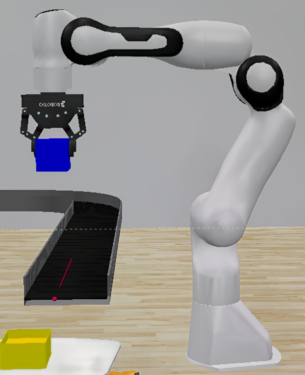

*Na imagem, o robô Franka aparece em vista lateral, segurando o bloco logo após retirá-lo da esteira.*

---

### 🚙 **2. Robô Móvel youBot**

O **youBot** atua como o transportador do sistema.
Ele recebe o bloco diretamente do Franka, desloca-se até a área de armazenamento e posiciona-se de modo que o **UR10** possa coletar o objeto.

📷 *Imagem:*

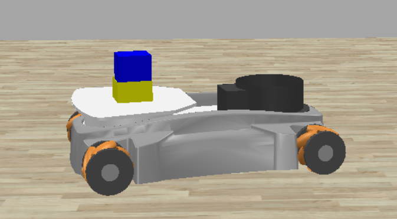

*Na imagem, o robô youBot é visto transportando a caixa em sua plataforma, deslocando-se até o ponto de entrega definido.*

---

### 🦾 **3. Robô Industrial UR10**

O **UR10** é responsável pela etapa final: armazenar o bloco na estante.
Com seu longo alcance e articulações precisas, ele posiciona a caixa em prateleiras específicas, encerrando o ciclo de transporte.

📷 *Imagem:*

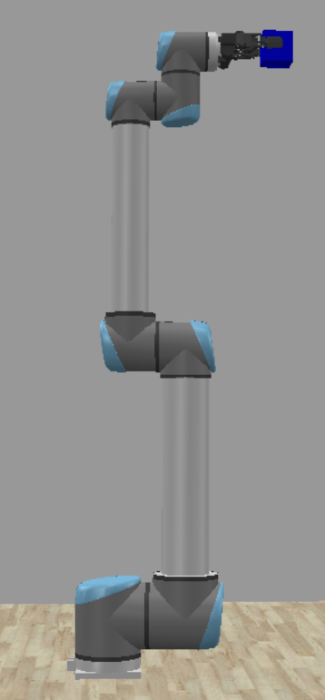

> Mostre o **UR10** estendendo o braço até a estante, segurando a caixa.
> Arquivo: `docs/img/ur10.png`

*Na imagem, o robô UR10 aparece segurando a caixa, logo após recebê-la do youBot.*

---

### 🔦 **4. Sensor Infravermelho**

O **sensor IR** é o ponto de partida de todo o sistema.
Quando um bloco passa pela frente do sensor, ele detecta a presença e publica uma mensagem MQTT, notificando o robô **Franka** para iniciar a sequência.

📷 *Imagem:*

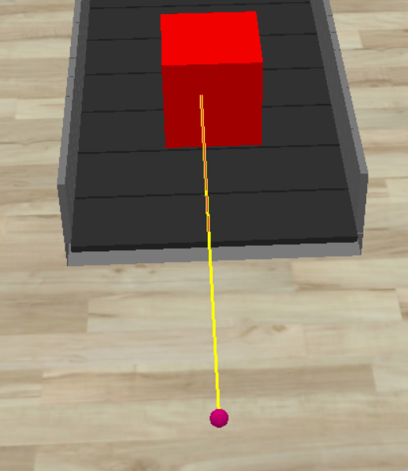

*Na imagem, observa-se o sensor infravermelho no momento da detecção da caixa na esteira transportadora.*

---

### 🧱 **5. Elementos do Ambiente**

O ambiente do CoppeliaSim foi projetado para representar uma pequena linha de produção automatizada, com os seguintes componentes:

* **Esteira Transportadora:** conduz os blocos até o sensor infravermelho.
  📷 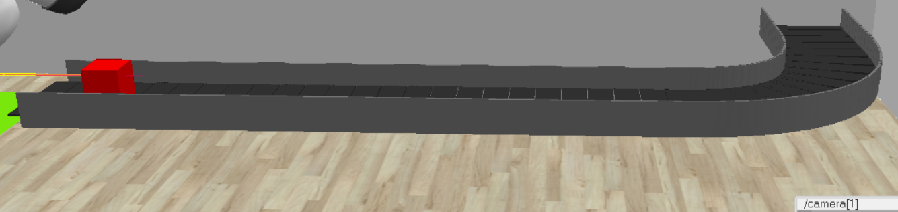

* **Caixa (bloco de transporte):** elemento central da tarefa colaborativa entre os robôs.
📷 
  <p align="center">
  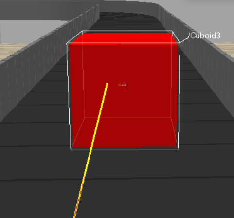
  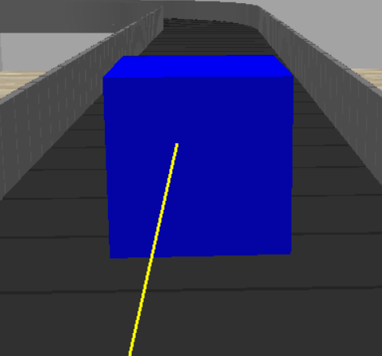
</p>

<p align="center">
  <em>Caixas manipuladas pelos robôs — vermelha e azul.</em>
</p>

* **Estante de Armazenamento:** destino final dos blocos manipulados pelo UR10.
  📷 
  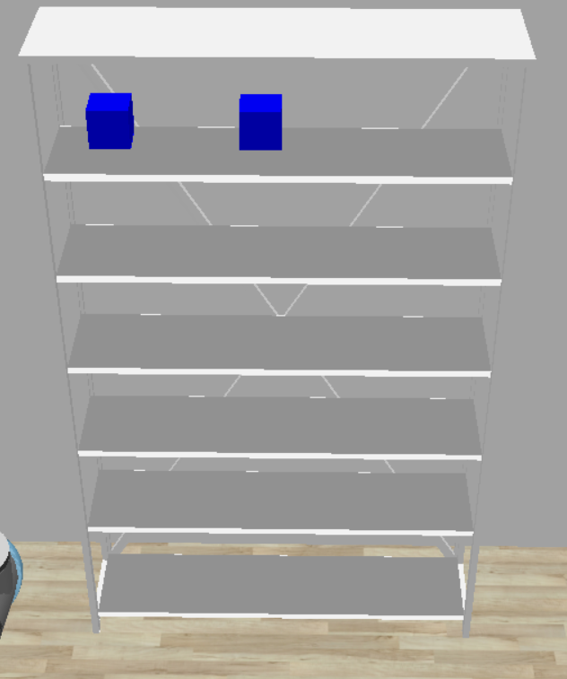

Cada um desses elementos foi configurado com sensores de colisão e scripts de movimentação, garantindo realismo físico e coordenação entre os agentes.

---

### 🌍 **6. Visão Geral do Cenário**

Para compreender a disposição espacial e o fluxo de trabalho dos agentes, são apresentadas duas perspectivas principais do ambiente no **CoppeliaSim**:

* **Vista Superior:** mostra todo o layout, com o caminho percorrido pelos blocos — da esteira até a estante.
  📷 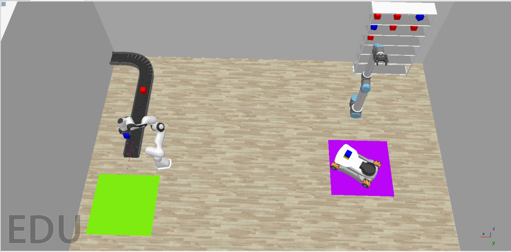

* **Vista Frontal:** destaca a interação entre os robôs, permitindo observar o alinhamento das transferências.
  📷 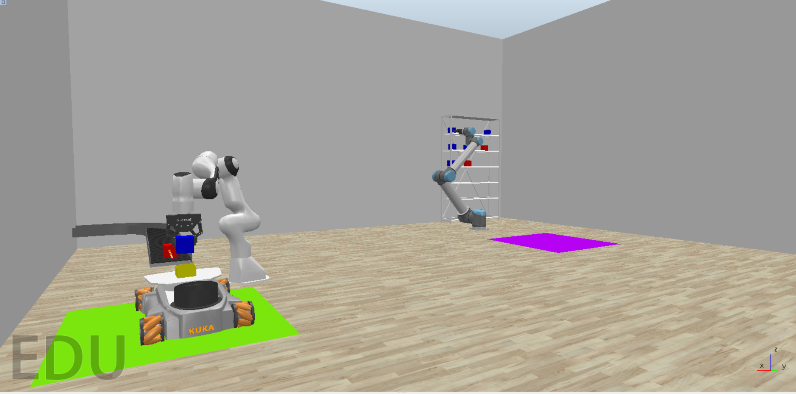

Essas imagens oferecem uma visão global da coordenação entre os agentes, essencial para entender o comportamento distribuído do sistema.

---

### 🎥 **7. Demonstração em Vídeo**

Além das imagens estáticas, o projeto conta com uma demonstração completa mostrando o sistema em operação — desde a detecção do bloco até seu armazenamento final.

📽️ *Assista ao vídeo da simulação:*

> [](https://youtu.be/BCb5b9ioSkM)

> *(Clique na imagem para assistir à execução no YouTube.)*

📂 *Ou veja a versão local (GIF curto):*
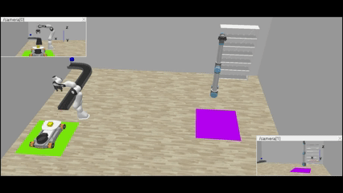

---